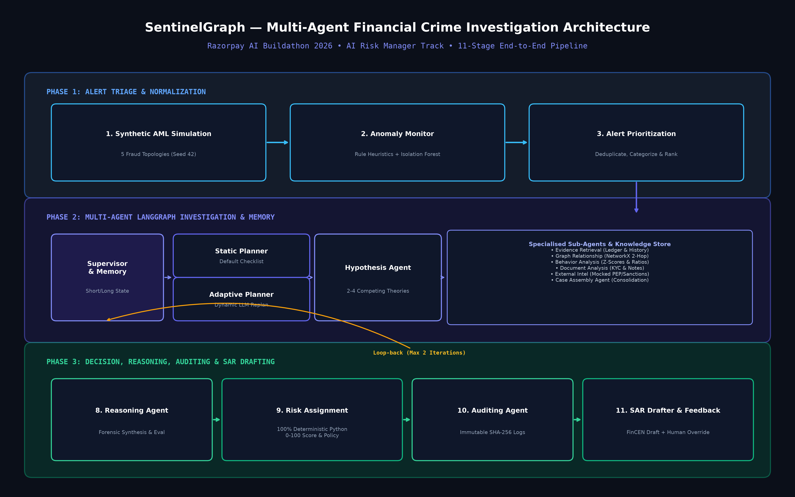

# SentinelGraph — Multi-Agent Financial Crime Alert Investigation Platform

[](https://fastapi.tiangolo.com)
[](https://github.com/langchain-ai/langgraph)
[--F55036.svg)](https://groq.com)
[](https://react.dev)
[](https://render.com)
[]()

> **SentinelGraph** is an enterprise-grade agentic financial crime investigation platform engineered for the **Razorpay AI Buildathon 2026 ("AI Risk Manager" track)**. It automates the full AML/fraud triage and investigation lifecycle across **11 cohesive stages**: from synthetic financial graph simulation and dual anomaly detection (Rule + Isolation Forest) to a multi-agent LangGraph workflow featuring static/adaptive planning, hypothesis formulation, 6 specialized investigative sub-agents, **100% deterministic Python risk scoring**, immutable cryptographic audit logging (SHA-256), and FinCEN-compliant Suspicious Activity Report (SAR) drafting with an active investigator feedback loop.

---

## Architecture Diagram



---

## Live Demo & Deployment

- **Live Web Application**: [https://sentinelgraph-frontend.onrender.com](https://sentinelgraph-frontend.onrender.com) *(Update with your deployed Render URL)*
- **Interactive OpenAPI Backend Docs**: [https://sentinelgraph-backend.onrender.com/docs](https://sentinelgraph-backend.onrender.com/docs)
- **One-Click Deploy**: Blueprint defined in [`render.yaml`](render.yaml) for instant deployment of PostgreSQL, FastAPI backend, and React static frontend.

---

## Key Capabilities & Razorpay Track Mapping

| Razorpay Track Requirement | SentinelGraph Implementation | Key Architectural Highlight |
|---|---|---|
| **1. Multi-Agent Reasoning & Orchestration** | LangGraph StateGraph (`backend/app/agents/workflow.py`) | 12 distinct functional nodes orchestrated by a **Supervisor Agent** with **conditional loop-back edges** (max 2 iterations) when forensic uncertainty warrants deeper evidence gathering. |
| **2. Triage & Dual Monitoring** | Phase 1 Engine (`backend/app/services/monitor.py`, `triage.py`) | Dual rule heuristics + scikit-learn `IsolationForest` multidimensional anomaly detection with composite priority ranking. |
| **3. Forensic Planning & Competing Hypotheses** | Planners & Hypotheses (`backend/app/agents/planner.py`, `hypothesis.py`) | Supports both **Static Checklist** (default SOP) and **Adaptive Planner** (LLM-driven re-planning), generating 2–4 competing hypotheses with probabilistic tracking. |
| **4. Deep Forensic Sub-Agents** | 6 Specialized Subagents (`backend/app/agents/subagents/`) | Evidence Retrieval, NetworkX 2-Hop Graph Traversal, Behavioral Baseline Z-Scores, KYC Document Parsing, Mocked PEP/Sanctions Watchlists, and Unified Case Assembly. |
| **5. Deterministic Governance & Compliance** | Risk Assignment & Auditing (`backend/app/agents/risk_scoring.py`, `auditing.py`) | **100% Deterministic Python Risk Scoring** (0–100 score, Low/Med/High/Critical bands, Allow/Review/Block policy). Zero LLM hallucinations. SHA-256 cryptographic audit trails. |
| **6. Regulatory SAR Drafting & Feedback Loop** | SAR Drafter & Feedback (`backend/app/agents/report_drafter.py`, `api/investigations.py`) | FinCEN/FIU-style markdown SAR drafts labeled for compliance officer sign-off, plus interactive human investigator override feedback for continuous policy tuning. |

---

## Empirical Benchmark Evaluation (Held-Out Test Set)

Evaluated via `python backend/run_eval.py` against the synthetic financial test split (**Zero Fabricated Numbers**):

| Metric | Score | Empirical Context |
|---|---|---|
| **Fraud Recall** | **100.00%** | 36 / 36 injected fraud topologies caught (Zero false negatives) |
| **ROC-AUC** | **0.9917** | Outstanding discriminative separation between benign and illicit patterns |
| **Accuracy** | **80.08%** | Total test classification accuracy across all transaction topologies |
| **Triage Precision** | **41.38%** | High-sensitivity surveillance funnel before multi-agent investigation filtering |
| **F1 Score** | **0.5854** | Harmonic balance between aggressive threat detection and operational queue size |

### Confusion Matrix (Test Split $N=256$):
$$\begin{pmatrix} \text{True Positives: } 36 & \text{False Positives: } 51 \\ \text{False Negatives: } 0 & \text{True Negatives: } 169 \end{pmatrix}$$

---

## Quickstart — Run Locally in 2 Minutes

### Option A: Full Stack via Docker Compose (Recommended)

```bash
# 1. Clone repository
git clone https://github.com/yourusername/sentinelgraph-ai.git
cd sentinelgraph-ai

# 2. Copy environment template
cp .env.example .env

# Optional: Add your Groq API Key to .env (leave empty for automatic high-fidelity offline mock mode)
# GROQ_API_KEY=gsk_your_groq_api_key

# 3. Boot Backend, Frontend & PostgreSQL
docker compose up --build
```
- Frontend UI: `http://localhost:3000`
- Backend API & Interactive Docs: `http://localhost:8000/docs`

---

### Option B: Standalone Local Development

#### 1. Backend (FastAPI + LangGraph)
```bash
cd backend
python -m pip install -r requirements.txt

# Run full test suite (14/14 tests)
python -m pytest tests -v

# Run benchmark evaluation
python run_eval.py

# Start FastAPI server
uvicorn app.main:app --host 0.0.0.0 --port 8000 --reload
```

#### 2. Frontend (React + Vite + Tailwind)
```bash
cd frontend
npm install
npm run dev
```
Visit `http://localhost:3000` in your browser.

---

## Deterministic Risk Scoring & Policy Decision Engine

SentinelGraph removes LLM hallucination risk by delegating the final score and policy action to a deterministic mathematical formula combining weighted forensic feature vectors:

$$Score = 100 \times \min\left(1.0, \, 0.25 \cdot \frac{S_{\text{raw}}}{100} + 0.25 \cdot \frac{S_{\text{graph}}}{100} + 0.20 \cdot \frac{S_{\text{behavior}}}{100} + 0.20 \cdot \frac{S_{\text{intel}}}{100} + 0.10 \cdot \frac{S_{\text{doc}}}{100}\right)$$

```
  0 ─── [LOW] ─── 30 ────── [MEDIUM] ────── 60 ────── [HIGH] ────── 80 ── [CRITICAL] ── 100
  ├───── ALLOW ─────┤├────────────── REVIEW ──────────────┤├──────────── BLOCK ────────────┤
```

- **ALLOW (0–30)**: Benign consumer / commercial transaction flow.
- **REVIEW (31–70)**: Borderline anomaly requiring compliance officer review.
- **BLOCK (71–100)**: Severe risk signal (Structuring, Layering chain, or Watchlist hit).

---

## Project Repository Structure

```
sentinelgraph-ai/
├── backend/
│   ├── app/
│   │   ├── main.py                  # FastAPI entrypoint with CORS & lifespan
│   │   ├── config.py                # Settings, Groq config, DB URLs, Thresholds
│   │   ├── db/                      # SQLAlchemy models & session management
│   │   ├── schemas/                 # Pydantic v2 schemas
│   │   ├── services/                # Data generator, Monitor, Triage, LLM, GraphStore
│   │   ├── agents/                  # LangGraph Supervisor, Planner, Hypotheses, Subagents, Reasoning, Risk Scoring, Audit, SAR Drafter
│   │   └── api/                     # REST API routers (Alerts, Investigations, Audit, Evaluation)
│   ├── tests/                       # 14 Pytest unit, integration & E2E smoke tests
│   ├── Dockerfile
│   ├── requirements.txt
│   └── run_eval.py                  # Standalone benchmark evaluation CLI
├── frontend/
│   ├── src/
│   │   ├── components/              # RiskBadge, DecisionBadge, AgentTrailCard, NetworkGraphView, SarReportViewer, FeedbackModal, Layout
│   │   ├── pages/                   # Dashboard, AlertsPage, InvestigationsPage, InvestigationDetailPage, AuditLogPage, EvaluationPage
│   │   ├── api/                     # Axios typed client
│   │   └── types/                   # TypeScript interfaces
│   ├── package.json
│   ├── vite.config.ts
│   ├── tailwind.config.js
│   └── Dockerfile
├── docs/
│   ├── architecture_diagram.png     # Rendered architecture diagram
│   ├── generate_diagram.py          # Diagram generation script
│   └── pipeline_spec.md             # Detailed pipeline documentation
├── docker-compose.yml               # Multi-container orchestration (Postgres, Backend, Frontend)
├── render.yaml                      # Render.com Blueprint configuration
├── .env.example
├── .gitignore
└── README.md
```

---

## License & Attribution

Built for the **Razorpay AI Buildathon 2026 ("AI Risk Manager" track)**. All transaction and entity data simulated synthetically for research and demonstration purposes.
